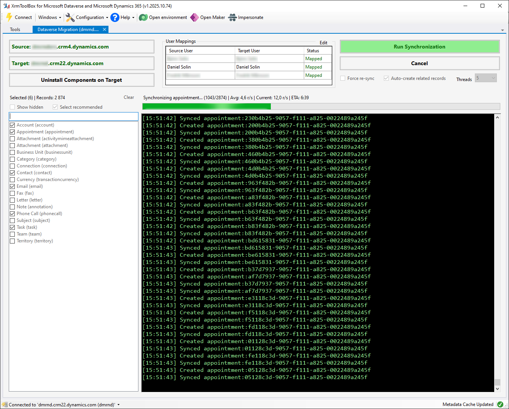

<figure>
   <figcaption>XrmToolBox Plugin</figcaption>
  
</figure>

Dataverse Migrator (dvmig) is a synchronization/migration engine that can be
used to sync/migrate data between CDS/Dataverse/Dynamics environments while
preserving audit data and entity/table relations. It comes with two separate
UIs:
- `dvmig.XTB`: An XrmToolBox plugin.
- `dvmig.CLI`: A terminal-based user interface (TUI).

## dvmig.XTB - XrmToolBox Plugin

`dvmig.XTB` is the XrmToolBox plugin for Dataverse Migrator.

Install it from XrmToolBox Tool Library using package id `dvmig.XTB`, or
get the NuGet package directly from
[NuGet.org](https://www.nuget.org/packages/dvmig.XTB/).

See the [Dataverse Migrator XrmToolBox Guide](docs/XTB-GUIDE.md) for detailed
instructions.
  
## dvmig.CLI - TUI App

`dvmig.CLI` is the TUI app for Dataverse Migrator.

See the [Dataverse Migrator CLI Guide](docs/CLI-GUIDE.md) for detailed
instructions.

## Highlights

- **Audit Preservation:** `CreatedOn` and `ModifiedOn` are preserved by an
  auto-deployed plugin (`dvmig.Plugins.DMPlugin`). `CreatedBy` and `ModifiedBy`
  are preserved by impersonation - mapping users between source and target
  environments automatically by matching full name or email, or using user-
  defined mappings (XrmToolBox plugin only).
- **Data Integrity:** Preserves essential metadata and relationships - if an
  referenced record (like Primary Contact) does not exist on Target environment,
  it will be automatically created.
- **Synchronization:** Built with `Polly` for resilience, handling transient
  errors and automatic retry strategies.
- **Performance:** User-configurable parallelism. See performance table below.
  *(Note: Dataverse enforces API rate limits. When these limits are hit, dvmig
  throttles requests, which may make the app appear stalled or frozen.  This is
  normal behavior and cannot be bypassed.)*
  
## Architecture

- `src/dvmig.Core`: .NET Standard 2.0 library containing the migration logic.
- `src/dvmig.XTB`: XrmToolBox plugin providing a GUI for using the sync/migrate
functionality from `dvmig.Core`.
- `src/dvmig.Cli`: .NET 9.0 app providing a TUI for using the sync/migrate
functionality from `dvmig.Core`.
- `src/dvmig.Plugins`: Dataverse plugin for preserving audit fields.
- `src/dvmig.Tests`: Unit test project using `xUnit`, `Moq`, and `Bogus`.
  
The diagram below visualizes the synchronization process used in dvmig.Core.
It handles preservation of audit fields, resolves dependencies, and executes
in parallel (using SemaphoreSlim to comply with .NET Standard 2.0).

  
## Performance
Synchronizing a set of 2874 records, including `Account`, `Contact`, `Task`,
`Email`, `PhoneCall` and `Appointment`, running with 1, 3, 5, 7 and 10 threads,
produced these results:  
  
| Threads | Time | Seconds | Throughput |
| ---: | ---: | ---: | ---: |
| 1 | 28m 46s | 1726s | ~1.7 records/s |
| 3 | 9m 19s | 559s | ~5.1 records/s |
| 5 | 6m 00s | 360s | ~8.0 records/s |
| 7 | 6m 22s | 382s | ~7.5 records/s |
| 10 | 7m 08s | 428s | ~6.7 records/s |
  
Five threads is therefore set as default in dvmig.
