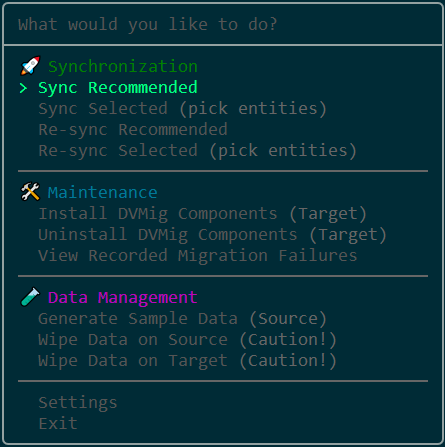
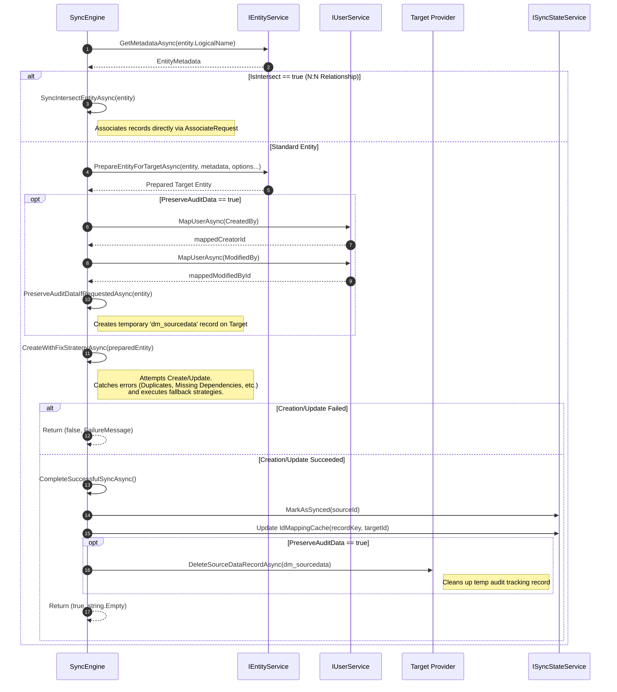

# dvmig Main Menu



### Features

1. **Synchronization (🚀)**
   - **Sync Recommended:** Synchronizes a curated list of entities.
   - **Sync Selected:** Allows manual entity selection.
   - **Re-sync:** Ignores sync state and forces an update of all records.

2. **Maintenance (🛠️)**
   - **Install dvmig Components:** Installs custom entities and plugin.
   - **Uninstall dvmig Components:** Removes plugin and entities.
   - **View Recorded Migration Failures:** Lists failure logs.

3. **Data Management (🧪)**
   - **Generate Sample Data:** Seeds the source environment with mock
     data.
   - **Wipe Data (Source/Target):** Purges data from environments.

## Highlights

- **Data Integrity:** Preserves essential metadata and relationships.
- **Audit Preservation:** Uses an auto-deployed plugin to ensure presevation
  of the `CreatedOn` and `ModifiedOn` fields. `CreatedBy` and `ModifiedBy`
  are preserved by auto-mapped impersonation (users are mapped between source
  and target environments by either full name or email).
- **Synchronization:** Built with resilience in mind using `Polly` for 
  handling transient errors and automatic retry strategies.
- **Interactive TUI:** Powered by `Spectre.Console`.
- **Error Logging:** Detailed error/warning/info logging to file.
- **Settings:** Settings and connections strings are stored in a user-specific
- settings.json for persistence across sessions. Connection strings are encrypted.

## Architecture

- `src/dvmig.Cli`: .NET 9.0 CLI application built with `Spectre.Console`.
- `src/dvmig.Core`: .NET Standard 2.0 library containing the migration logic.
- `src/dvmig.Plugins`: Dataverse plugin for preserving audit fields.
- `src/dvmig.Tests`: Unit test project using `xUnit`, `Moq`, and `Bogus`.

## Prerequisites

- [.NET 9.0 SDK](https://dotnet.microsoft.com/download/dotnet/9.0)
- Source and Target Dataverse/Dynamics 365 environments.

## Installation / Building

Clone the repository and build the solution:

```console
# Clone the repository
git clone https://github.com/danielsolin/dvmig.git
cd dvmig

# Build the solution
dotnet restore
dotnet build
```

## Usage

Start the CLI/TUI from the root directory like so:

```console
dotnet run --project src/dvmig.Cli
```

When running the app for the first time, start by selecting "Configuration"
at the main menu to set connection strings for Source and Target environments.

Example connection string:

```code
# Will open a login window in your default browser:
AuthType=OAuth;Url=https://<your-instance>.crm.dynamics.com;
RedirectUri=http://localhost/;LoginPrompt=Auto;
```

You can also test the connection strings here to make sure they work.

## Synchronizaion Process
This diagram visualizes the synchronization process used in dvmig.Core. It
handles preservation of audit fields, resolves dependencies, and excutes in
parallell (using SemaphoreSlim to comply with .NET Standard 2.0).


