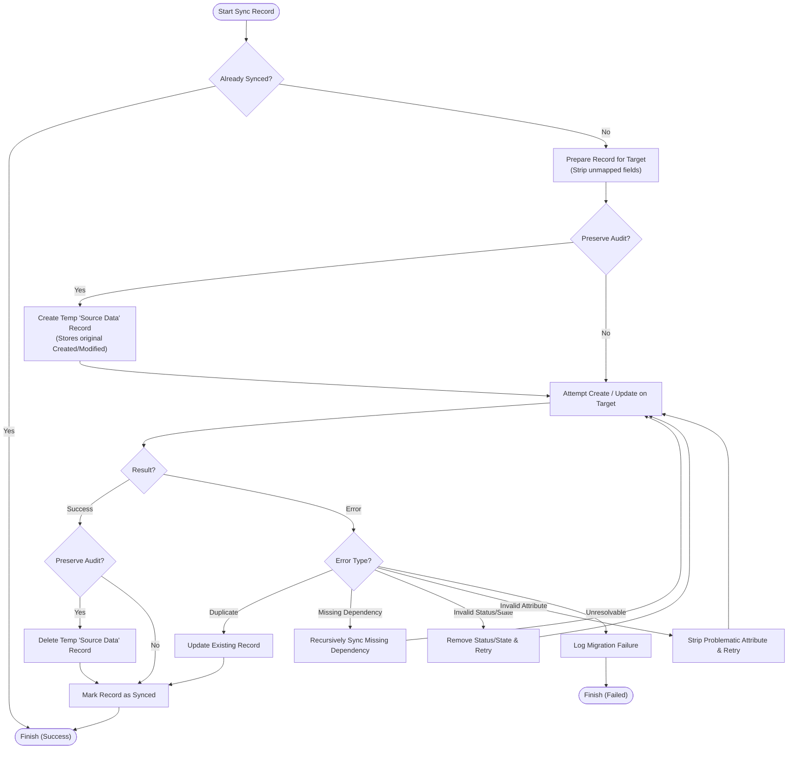

## Highlights

- **Audit Preservation:**
   * `CreatedOn` and `ModifiedOn` are preserved by an auto-deployed plugin
     (`dvmig.Plugins.DMPlugin`).
   * `CreatedBy` and `ModifiedBy` are preserved by auto-mapped impersonation -
     users are mapped between source and target environments by either full name
     or email.
- **Data Integrity:** Preserves essential metadata and relationships - if an
  referenced record (like Primary Contact) does not exist on Target environment,
  it will be automatically created.
- **Synchronization:** Built with `Polly` for resiliance, handling transient
  errors and automatic retry strategies. *(Note: Dataverse enforces API rate
  limits. When these limits are hit, dvmig throttles requests, which may make
  the app appear stalled or frozen.  This is normal behavior and cannot be
  bypassed.)*
- **Interactive TUI:** Using `Spectre.Console`.
- **Logging:** Detailed error/warning/info logging
  (see C:\Users\USERNAME\AppData\Roaming\dvmig).

## Installation / Building

You can either download a binary release or clone the repo and built it yourself.

* Download:
   * Get the latest [release](https://github.com/danielsolin/dvmig/releases),
   * Unzip it, right-click `dvmig.Cli.exe` and select "Properties". Check "Unblock" at
     the bottom of the "General" tab and click "Ok".
   * Double-click `dvmig.Cli.exe`.

* Build:
   ```console
   # Clone the repository
   git clone https://github.com/danielsolin/dvmig.git
   cd dvmig

   # Build the solution
   dotnet restore
   dotnet build

   # Run
   dotnet run --project src/dvmig.Cli
   ```

## Usage

When running the app for the first time, start by selecting "Configuration"
on the main menu to set connection strings for Source and Target environments.

Example connection string:

```code
# Will open a login window in your default browser:
AuthType=OAuth;Url=https://<your-instance>.crm.dynamics.com;RedirectUri=http://localhost/;LoginPrompt=Auto;
```

You can also test the connection strings in the app to make sure they work.

### Main Menu

**Synchronization (🚀)**
   - **Sync Recommended:** Synchronizes `Account`, `Contact`, `Task`, `Email`,
     `PhoneCall` and `Appointment`.
   - **Sync Selected:** Allows manual entity selection.
   - **Re-sync:** Ignores sync state and forces an update of all records.

**Maintenance (🛠️)**
   - **Install dvmig Components:** Installs custom entities and plugin.
   - **Uninstall dvmig Components:** Removes plugin and entities.
   - **View Recorded Migration Failures:** Lists failure logs.

**Data Management (🧪)**
   - **Generate Sample Data:** Seeds the source environment with mock
     data.
   - **Wipe Data (Source/Target):** Purges data from environments.

**Settings**
   - Define connection strings, max threads for parallelism etc.

## Architecture

- `src/dvmig.Cli`: .NET 9.0 CLI application built with `Spectre.Console`.
- `src/dvmig.Core`: .NET Standard 2.0 library containing the migration logic.
- `src/dvmig.Plugins`: Dataverse plugin for preserving audit fields.
- `src/dvmig.Tests`: Unit test project using `xUnit`, `Moq`, and `Bogus`.
- `src/dvmig.XTB`: XrmToolBox plugin. Can technically sync records, but is
  significantly slower and less robust than the CLI version.

The diagram below visualizes the synchronization process used in dvmig.Core.
It handles preservation of audit fields, resolves dependencies, and excutes
in parallell (using SemaphoreSlim to comply with .NET Standard 2.0).


