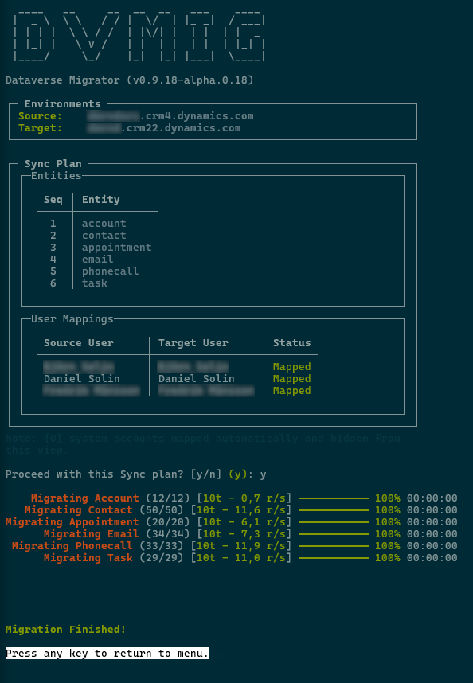

## Highlights

- **Audit Preservation:** `CreatedOn` and `ModifiedOn` are preserved by an
  auto-deployed plugin (`dvmig.Plugins.DMPlugin`). `CreatedBy` and `ModifiedBy`
  are preserved by auto-mapped impersonation - mapping users between source and
  target environments by either full name or email.
- **Data Integrity:** Preserves essential metadata and relationships - if an
  referenced record (like Primary Contact) does not exist on Target environment,
  it will be automatically created.
- **Synchronization:** Built with `Polly` for resiliance, handling transient
  errors and automatic retry strategies.
- **Performance:** User-configurable parallelism. See performance table below.
  *(Note: Dataverse enforces API rate limits. When these limits are hit, dvmig
  throttles requests, which may make the app appear stalled or frozen.  This is
  normal behavior and cannot be bypassed.)*
  
## Architecture

- `src/dvmig.Core`: .NET Standard 2.0 library containing the migration logic.
- `src/dvmig.XTB`: XrmToolBox plugin providing a GUI for using the sync/migrate
functionality from `dvmig.Core`.
- `src/dvmig.Cli`: .NET 9.0 app providing a TUI for using the sync/migrate
functionality from `dvmig.Core`.
- `src/dvmig.Plugins`: Dataverse plugin for preserving audit fields.
- `src/dvmig.Tests`: Unit test project using `xUnit`, `Moq`, and `Bogus`.
  
The diagram below visualizes the synchronization process used in dvmig.Core.
It handles preservation of audit fields, resolves dependencies, and excutes
in parallell (using SemaphoreSlim to comply with .NET Standard 2.0).


  
## Performance
A test set of 2874 records, including `Account`, `Contact`, `Task`, `Email`,
`PhoneCall` and `Appointment`, produced these results:  
  
| Threads | Time | Seconds | Throughput |
| ---: | ---: | ---: | ---: |
| 1 | 28m 46s | 1726s | ~1.7 records/s |
| 3 | 9m 19s | 559s | ~5.1 records/s |
| 5 | 6m 00s | 360s | ~8.0 records/s |
| 7 | 6m 22s | 382s | ~7.5 records/s |
| 10 | 7m 08s | 428s | ~6.7 records/s |
  
Five threads is therefore set as default in dvmig.  

## Installation / Building

You can either download a binary release or clone the repo and built it
yourself.

* Download:
   * Get the latest [release](https://github.com/danielsolin/dvmig/releases),
   * Unzip it, right-click `dvmig.Cli.exe` and select "Properties". Check
     "Unblock" at the bottom of the "General" tab and click "Ok".
   * Double-click `dvmig.Cli.exe`.

* Build:
   ```console
   # Clone the repository
   git clone https://github.com/danielsolin/dvmig.git
   cd dvmig

   # Build the solution
   dotnet restore
   dotnet build

   # Run
   dotnet run --project src/dvmig.Cli
   ```

## Usage

When running the app for the first time, start by selecting "Configuration"
on the main menu to set connection strings for Source and Target environments.

Example connection string:

```code
# Will open a login window in your default browser:
AuthType=OAuth;Url=https://<your-instance>.crm.dynamics.com;RedirectUri=http://localhost/;LoginPrompt=Auto;
```

You can also test the connection strings in the app to make sure they work.

### Main Menu

**Synchronization (🚀)**
   - **Sync Recommended:** Synchronizes `Account`, `Contact`, `Task`, `Email`,
     `PhoneCall` and `Appointment`.
   - **Sync Selected:** Allows manual entity selection.
   - **Sync View:** Sync records in a view.
   - **Re-sync:** Ignores sync state and forces an update of all records.

**Maintenance (🛠️)**
   - **Install dvmig Components:** Installs custom entities and plugin.
   - **Uninstall dvmig Components:** Removes plugin and entities.
   - **View Recorded Migration Failures:** Lists failure logs.

**Data Management (🧪)**
   - **Generate Sample Data:** Seeds the source environment with mock
     data.
   - **Wipe Data (Source/Target):** Purges data from environments.

**Settings**
   - Define connection strings, max threads for parallelism etc.

