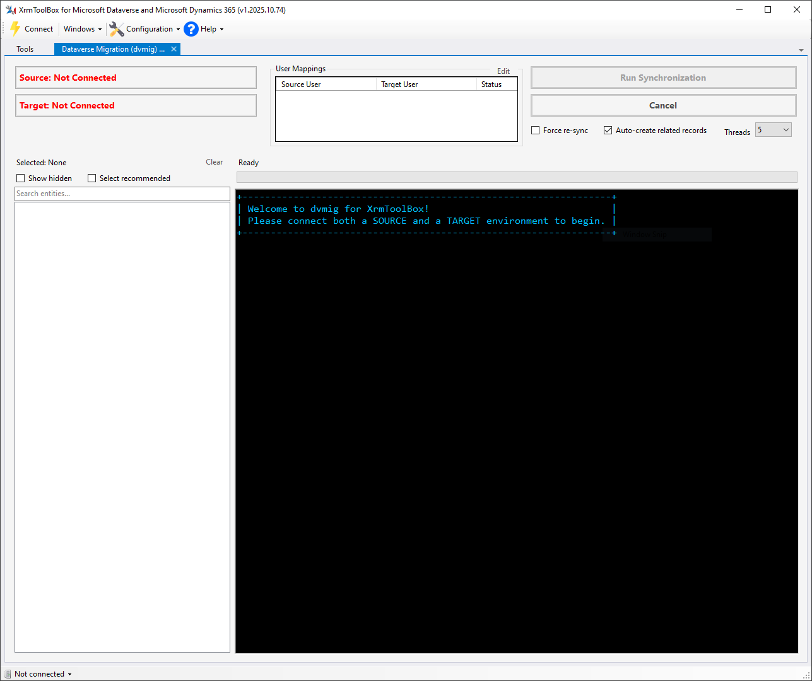
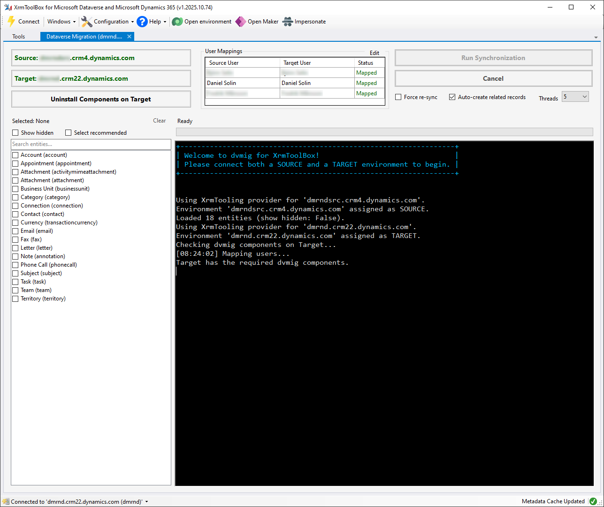
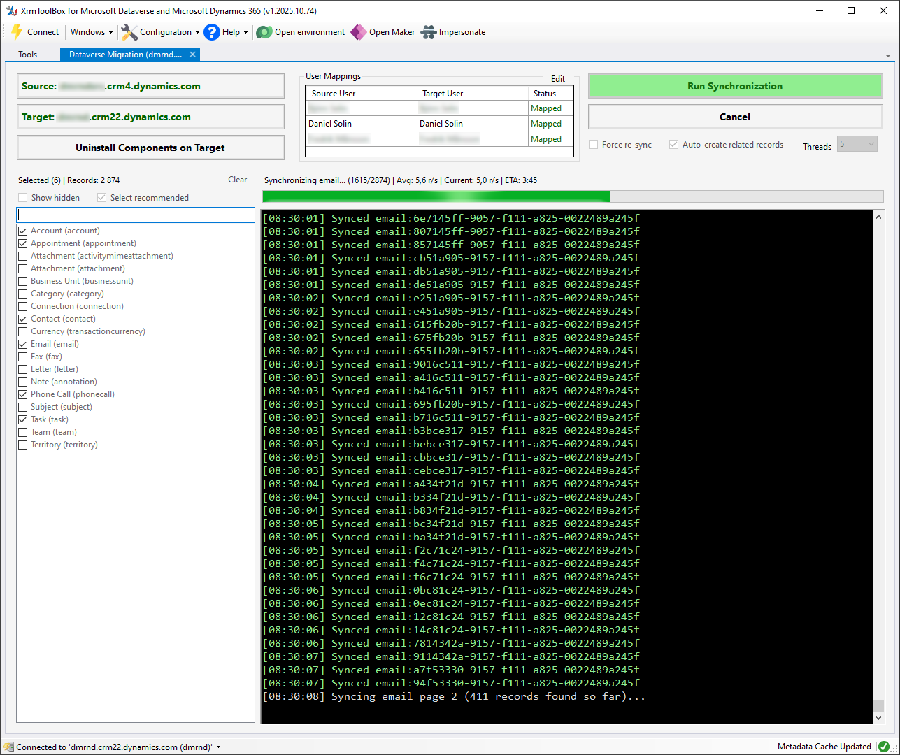
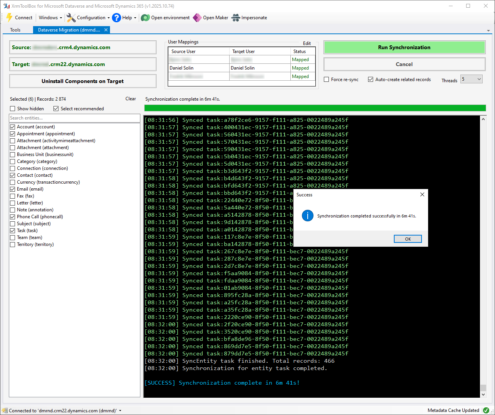

# Dataverse Migrator (dvmig.XTB) — User Guide

For the Dataverse Migrator XrmToolBox plugin, the typical workflow is:

1. Connect to a source and a target environment.
2. Review and optionally edit user mappings.
3. Select the entities you want to synchronize.
4. Choose synchronization options.
5. Run the synchronization and monitor progress.
6. Review the result when the synchronization is complete.

---

## 1. Startup



When the plugin opens, no environments are connected yet.

The **Source** and **Target** fields show `Not Connected`, and the **Run
Synchronization** button is disabled. The entity list is empty because the
plugin cannot load available entities until the **Source** environment is
known.

In the top left corner, click the corresponding **Source** and **Target**
buttons to connect to the environments you want to synchronize between.

---

## 2. Connected and ready



When a **Source** environment has been selected and connected, the plugin
loads available entities and presents them in the entity list on the left.

When a **Target** environment has been selected, the plugin makes sure that
it has the required components for synchronization installed. This includes
the `dvmig.Plugins.DMPlugin` plugin, and the custom entities/tables
`dm_sourcedata` and `dm_migrationfailure`. If any of these components are
missing, you will have to install them by clicking **Install Components
on Target** before proceeding.

After both environments are connected, the plugin performs an automated user
mapping process, trying to match users between the two environments based on
their full name or email address. The result of this mapping can be seen in the
top middle panel titled **User Mappings**. You can manually edit the mappings
by clicking the **Edit** button at the top right of the panel.

### Entity selection

Use the entity list on the left to choose which tables/entities should be
synchronized.

Each row shows the display name and logical name, for example:

- Account (`account`)
- Appointment (`appointment`)
- Contact (`contact`)
- Email (`email`)
- Phone Call (`phonecall`)
- Task (`task`)

The selection summary above the list shows how many entities are currently
selected and how many records are included in the synchronization scope.

### Selection helpers

Use **Select recommended** to quickly select commonly synchronized entities.

Use **Show hidden** to show all entities on the **Source** environment.

Use **Clear** to clear the current selection.

### Synchronization options

Before starting, review the available options:

**Force re-sync**  
Dataverse Migrator creates all records with the same GUID on the target
environment as they have on the source environment. This allows it to
know what records have already been synchronized. If you check this option,
even records that have already been synchronized will be re-synchronized.
This is useful if data has been changed on **Source**, or if related records
has been created on **Target** that were not present during the last
synchronization *Example: you have Accounts with missing Primary Contacts, and
you have now created those missing contacts on Target, so you want to re-sync
the Accounts to link them to the newly created contacts.*

**Auto-create related records**  
Allows the plugin to automatically create related records when needed during
synchronization. *Example: if you are syncing Accounts, any Contacts that are
set as Primary Contact on the Accounts will also be created if this option is
enabled.*

**Threads**  
Controls how many worker threads are used during synchronization. Higher values
can improve throughput, but may also increase load on the source and target
environments. Five threads is the default and recommended setting.

When the selected entities and options look correct, click **Run
Synchronization**.

---

## 3. Synchronization in progress



While synchronization is running, the plugin shows progress in several places.

The status text above the progress bar shows the current entity and overall
progress, including:

- Current entity being synchronized
- Current record count and total record count
- Average records per second
- Current records per second
- Estimated time remaining

The green progress bar shows overall progress through the selected
synchronization scope.

The console log shows detailed synchronization activity, including timestamps
and record identifiers. This is useful for monitoring progress and diagnosing
issues if something fails.

During synchronization, the entity selection and synchronization options are
disabled to prevent changes while work is in progress. The **Cancel** button
remains available if you need to stop the current run.

---

## 4. Synchronization finished



When synchronization completes successfully, dvmig shows a success message and
updates the status text above the log.

The console also writes a final success message, for example:

```text
[SUCCESS] Synchronization complete in 6m 41s!
```

After completion, the **Run Synchronization** button becomes available again.
You can then adjust the selection or options and run another synchronization
if needed.

---

## Basic usage summary

1. Open Dataverse Migrator in XrmToolBox.
2. Connect a **SOURCE** environment.
3. Connect a **TARGET** environment.
4. Wait for entities, mappings, and target component checks to load.
5. Select the entities to synchronize.
6. Review options such as **Force re-sync**, **Auto-create related records**,
and **Threads**.
7. Click **Run Synchronization**.
8. Monitor progress in the status text, progress bar, and console log.
9. Review the success message when synchronization completes.

---
